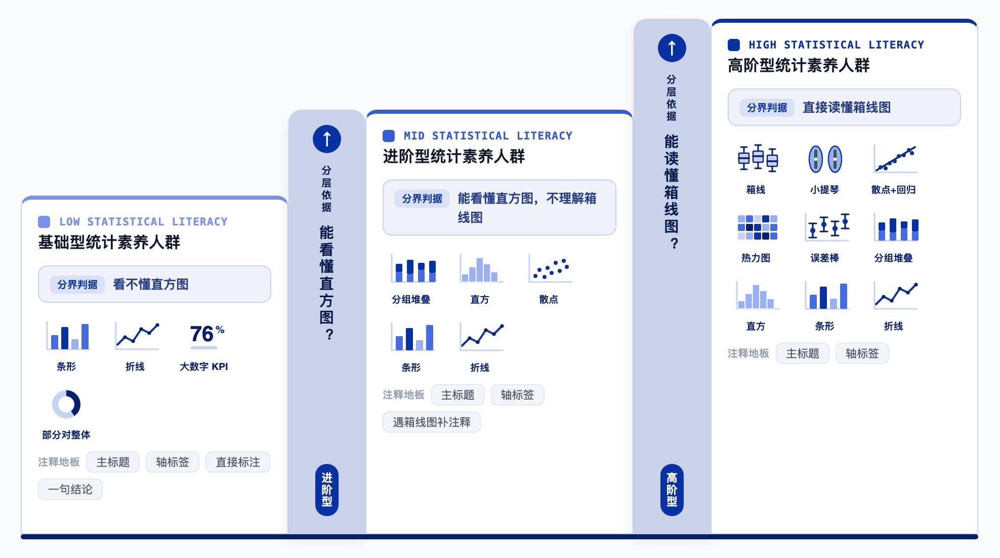
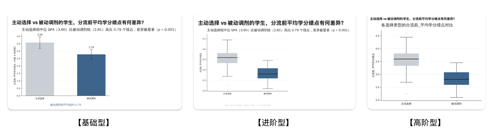
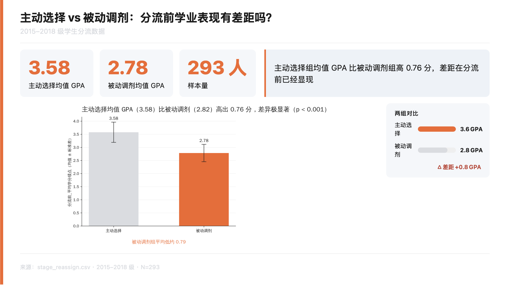

# Data Viz Studio

本地数据可视化 skill：给它一份数据集、一个数据问题、以及「这张图给谁看」，它会选择合适图型、设置必要注释，并输出自包含 HTML 图表。

核心判断只有一个：**受众的统计素养决定图表是什么；场合只决定图表怎么美化。**



## Quick Start

```python
import sys
sys.path.insert(0, "scripts")
import dataviz as dv

df = dv.load_dataframe("penguins.csv")
df = df.dropna(subset=["species", "body_mass_g"]).copy()
df["species_cn"] = df["species"].map({
    "Gentoo": "巴布亚(Gentoo)",
    "Chinstrap": "帽带",
    "Adelie": "阿德利",
}).fillna(df["species"])

dv.visualize(
    df,
    group_col="species_cn",
    value_col="body_mass_g",
    question="不同种类的企鹅，体重差多少？",
    insight="巴布亚企鹅明显是一个量级，平均约5076克；阿德利和帽带几乎一样重，都在3700克左右。",
    audience="low",
    emphasize="巴布亚(Gentoo)",
    save_to="penguin_body_mass.html",
)
```

输出是一个自包含 HTML。图表文字会在生成时转成 SVG 路径，减少浏览器端字体依赖，中文在不同机器上也能稳定显示。

## What It Does

**输入**

1. 数据集：`.csv` / `.xlsx` / `.xls` / `.json`
2. 数据问题：这张图要回答什么
3. 受众统计素养：`low` / `mid` / `high`；无法判断时传 `unknown`，内部按更保守的低门槛图像语言出图

**输出**

- 标准版 HTML 图表
- 可选 16:9 deck 版式
- 可按场合精修配色、注释密度和演示样式

**支持图型**

箱线图、均值 + 范围条、比率图、分组对比、直方图、折线趋势图、大数字 KPI、分面小多图、散点 + 回归、热力图。

## Audience Levels

受众不是按职业定义，而是按「能读懂哪种图型」定义。职业只是代理变量，常常会猜错。这里说的统计素养，会具体落到「能读懂哪些图型」。

| 受众档 | 分界判据 | 默认选型行为 | 基本注释信息 |
|--|--|--|--|
| 基础型统计素养人群（`low`） | 对直方图等分布图也需要明确引导 | 倾向降级为均值条、大数字 KPI、直接标注 | 主标题 + 轴标签 + 直接标注 + 一句结论 |
| 进阶型统计素养人群（`mid`） | 能理解直方图；箱线图需要辅助解读 | 保留信息量更高的图型，但补阅读指引 | 主标题 + 轴标签；临界图型补一句解读 |
| 高阶型统计素养人群（`high`） | 可直接读懂箱线图 | 使用完整图型，如箱线、散点回归、热力图 | 主标题 + 轴标签 |
| 未知受众（`unknown`） | 用户无法判断受众统计素养 | 内部按 `low` 保守出图 | 同 `low` |

同一数据、同一问题，面对不同受众会得到不同表达。下图和上方 Quick Start 使用同一份 Palmer Penguins 数据作为呈现示例。



## Workflow

```text
0. 上传数据集
1. 确定要回答的问题
2. EDA，得到洞察 insight
3. 按受众统计素养选型，交付标准版 HTML
4. 可选：按实际场合精修，或输出 16:9 deck
```

第 3 步只做标准版：中性配色、正确图型、必要注释。场合样式放到第 4 步，因为样式可逆，图型选错不可逆。

## Deck Mode

deck 是可选的 16:9 演示版式：KPI 卡、核心发现 callout、图表、可选差距条或迷你条排。它不重新选图，也不额外判断注释；图型和基本注释信息仍由 `scripts/dataviz` 生成。



调用方式：

```python
from scripts.deck import render_deck

render_deck(
    title="三种企鹅，体重一重两轻",
    subtitle="各种类平均体重对比 · 面向非统计背景受众",
    kpi_cards=[
        {"label": "巴布亚 平均体重", "value": "5076 克"},
        {"label": "阿德利 / 帽带 约", "value": "3700 克"},
        {"label": "最重比最轻多 · 37%", "value": "1.4 公斤"},
    ],
    callout="巴布亚（Gentoo）企鹅明显更重，是另一个量级；阿德利和帽带几乎一样重。",
    chart_svg=chart_svg,
    palette=dv.STANDARD_PALETTE,
    save_to="penguin_body_mass_deck.html",
)
```

## Design Notes

Data Viz Studio 的设计重点不是「把图画漂亮」，而是先把图画对。

**受众决定结构。** 图表类型、是否降级、是否需要直接标注，都是受众轴的判断。给基础型统计素养人群看散点图，和给高阶型统计素养人群看大数字 KPI，都会损失信息或增加理解成本。

**场合只管样式。** 主题色、字体、16:9 演示外壳、作品集叙事，都是出图后的可选精修。场合可以叠加注释，但不能删掉该受众所需的基本注释信息。

**逻辑保持单一真源。** 图型路由在 `_route()`，基本注释信息由 `_annotation_floor()` 计算，中性标准配色在 `STANDARD_PALETTE`，deck 样式 token 在 `assets/deck-tokens.css`。

**推理和渲染分层。** 模型负责理解问题和提出洞察；Python 渲染层负责确定性出图，避免每次手写 matplotlib 或 HTML 时引入新偏差。

## Project Structure

```text
data-viz-studio/
├── SKILL.md                       # skill 入口：触发条件、核心工作流、受众轴、自检清单
├── README.md                      # 项目说明与使用入口
├── assets/
│   ├── deck-tokens.css            # deck 字号、行距、间距、画布、卡片规格等 token
│   └── readme/                    # README 图片
├── scripts/
│   ├── deck.py                    # 16:9 演示版式：HTML/CSS 外壳 + 内嵌 SVG 图表
│   └── dataviz/
│       ├── __init__.py            # 渲染层公开 API 重导出
│       ├── config.py              # 调色板、受众配置、阅读指引常量
│       ├── fonts.py               # 中文字体守卫 + SVG 文字外框化
│       ├── io.py                  # 数据读取与 0/1 编码工具
│       ├── routing.py             # 图型路由、注释档计算、基数检查
│       ├── charts.py              # 图型基元
│       ├── render.py              # 自包含 HTML 组装
│       ├── visualize.py           # 主入口：路由 → 图元 → HTML
│       └── demo.py                # dataviz 包 demo
├── references/
│   ├── chart-catalog.md           # 图型目录、路由规则、覆盖参数说明
│   └── deck.md                    # deck 版式、槽位系统、render_deck 用法
├── test_routing_and_floor.py      # 路由、基本注释信息、字体和文本布局回归测试
└── gen_test_charts.py             # 产物级图库生成与 SVG/HTML 自检
```

## Dependencies

- Python 3
- `matplotlib`
- `pandas`
- `numpy`
- Excel 读取：`openpyxl` / `xlrd`

## Not For

- 实时数据流可视化
- 理科期刊投稿图
- 需要 PDF / EPS / 双栏版式的出版级图形管线
